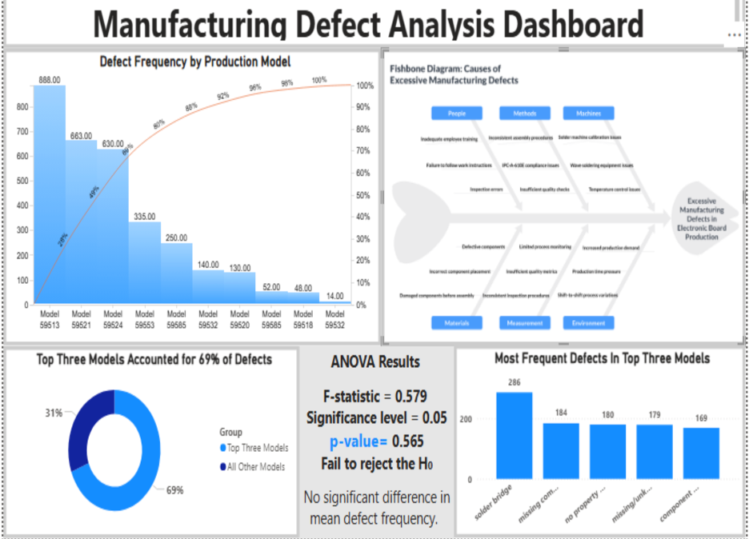
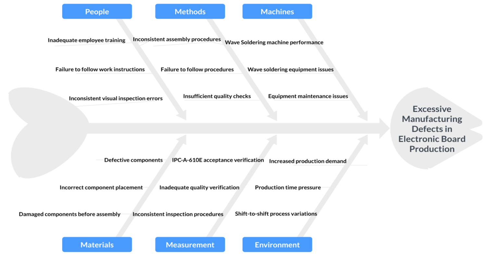
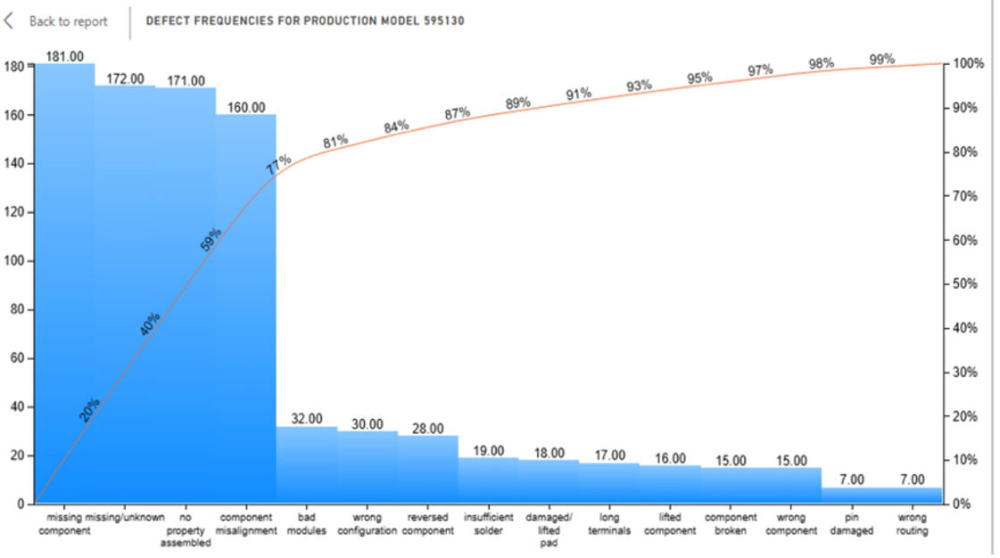
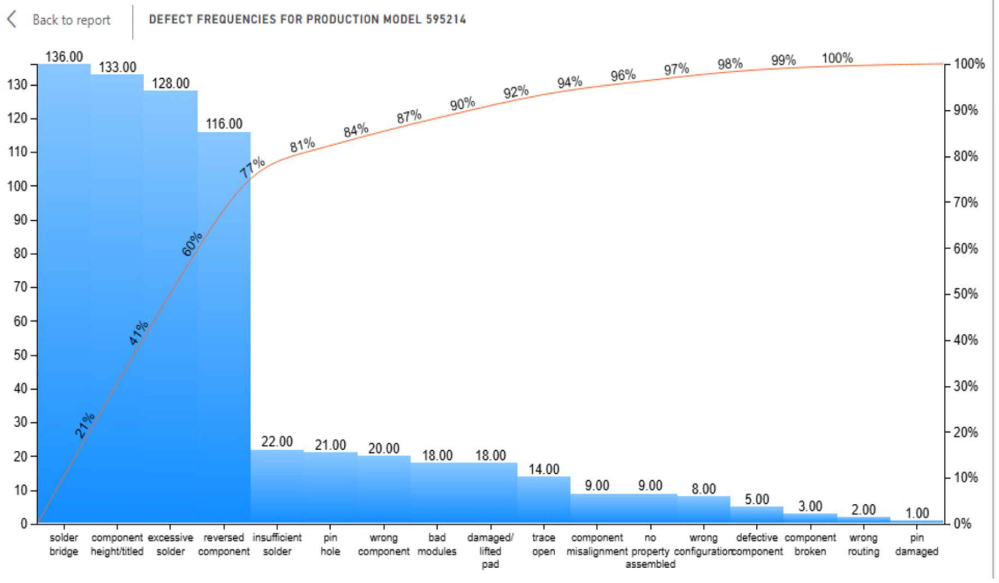
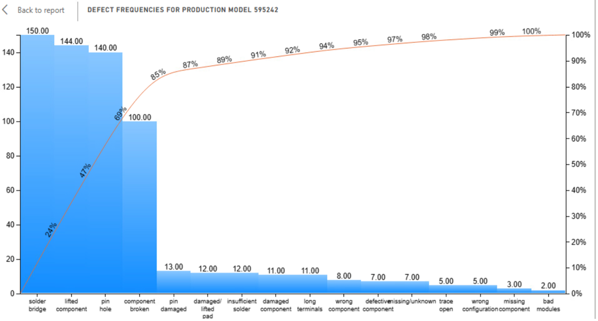

# Manufacturing Defect Analysis

## Project Overview

This project analyzes manufacturing defects in electronic board production to identify the production models and defect categories contributing most heavily to quality issues. The analysis combines exploratory data analysis, Power BI visualization, root-cause analysis, and statistical hypothesis testing to support process-improvement decisions.

## Dashboard Overview

## Business Objective

The organization sought to reduce welding-related defects by 20% while supporting a 20% increase in production capacity without increasing the overall defect percentage.

## Tools and Technologies

- Power BI
- Python
- Pandas
- SciPy
- Jupyter Notebook
- Statistical Hypothesis Testing
- Pareto Analysis
- Root-Cause Analysis

## Analytical Approach

The project followed an end-to-end analytical process that included:

1. Identifying the production models responsible for the highest defect volumes.
2. Analyzing defect categories within the highest-defect models.
3. Using Pareto analysis to identify priority areas for improvement.
4. Developing a fishbone diagram to organize potential operational contributors.
5. Performing a one-way ANOVA to evaluate whether mean defect frequency differed significantly among the three highest-defect production models.
6. Developing a Power BI dashboard to communicate findings and recommendations.

## Root-Cause Analysis

The fishbone analysis organized potential contributors to manufacturing defects across six operational areas: people, methods, machines, materials, measurement, and environment. These factors were treated as areas for further investigation rather than confirmed causes.

## Model-Level Pareto Analysis

After identifying Models 595130, 595214, and 595242 as the three highest-defect production models, each model was analyzed separately to determine which defect categories contributed most heavily to its total defect volume.

### Model 595130

Model 595130 had the highest overall defect total. Its defect pattern was concentrated primarily in missing components, missing/unknown classifications, assembly issues, and component misalignment.

### Model 595214

Model 595214 showed a different defect profile, with greater concentration in soldering- and component-related issues, including solder bridges, lifted components, excessive solder, and reversed components.

### Model 595242

Model 595242 showed the greatest concentration among its leading defect categories, with solder bridges, lifted components, pinholes, and broken components accounting for most of the model's defects.

## Key Findings

- Production Models 595130, 595214, and 595242 accounted for approximately 69% of the defects analyzed.
- Model 595130 showed a greater concentration of assembly and component-placement defects.
- Models 595214 and 595242 showed more prominent soldering-related defect patterns.
- The one-way ANOVA produced a p-value of approximately 0.565, providing insufficient evidence that mean defect frequency differed significantly among the three production models.
- The combined findings supported a broader process-improvement approach while continuing to monitor model-specific defect patterns.

## Recommendations

The analysis identified four initial process-improvement priorities:

- Standardize work instructions and assembly procedures.
- Review soldering equipment performance, maintenance, and process controls.
- Strengthen targeted employee training and inspection consistency.
- Continue monitoring defects by production model and defect category using the Power BI dashboard.

## Project Files

- [View Python ANOVA Notebook](notebooks/manufacturing_defect_anova.ipynb)
- [Download Power BI Dashboard (.pbix)](power-bi/manufacturing_defect_dashboard.pbix)
- [View Final Presentation](presentation/manufacturing_defect_analysis_presentation.pdf)
- [View Project Visualizations](images/)
- [Data Availability and Licensing](data/README.md)

## Data Note

The course-provided dataset is not redistributed because no explicit redistribution license was provided. See [Data Availability and Licensing](data/README.md) for additional details and case-study attribution.

## Project Background

This analysis was originally developed as part of an applied data analysis course and has been reformatted and expanded as a professional portfolio case study.
